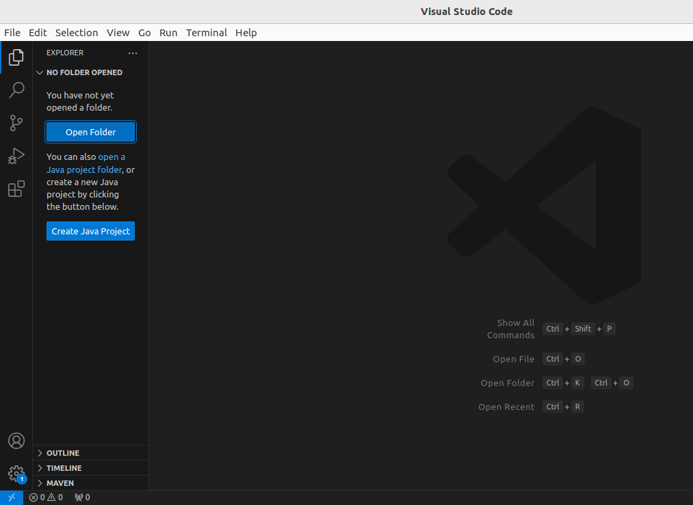

# HTML   Notes

# Table of contents

1.  What Is HTML
2. Install Up VsCode
3. First Html Fill
4. HTML Tag
5. Basic HTML Page
6.  Quick Points
7. Comments in HTML
8.  HTML is NOT case sensitive
9.  Basic HTML Tags
10. Heading Tag
11. Paragraph Tag
12. Anchor Tag
13. Image Tag
14. Br Tag
15. Bold, Italic & Underline Tags
16. Big & Small Tags
17. Hr Tag
18. Page Layout Techniques
19. Revisiting Anchor Tag
20. Revisiting Image Tag
21. Div Tag
22. List : Div Tags
23. Tables in HTML
24. Select

# 1.  What Is HTML:-
 >Hyper Text Markup Language
HTML is the code that is used to
structure a web page and its content.
The component used to design the
structure of websites are called HTML tags.

# 2.  Install Up VsCode
- Step 1:- Search on Google or Chrome Download VsCode.
- Step 2:- click on the first link.
  
  - VsCode Download :-
  
  

- Step 3:- After completion VS Code, Check your download Folder.
- Step 4:- Open Terminal in Linux or  for shortcut click (ctrl + alt + t)
- Step 5:- Check if the system up-to-date using following command :

    
                $ sudo apt-get update
- Step 6. After update system Now you can Install VS Code using the following command:

  
           $ sudo apt install vscode .

- Step 6. Open VS Code.          

   

- Step 6:- Create a new file.

 

# 3.  First Html Fill

              index.html

 - It is the default name for a website's homepage 

# 4. HTML Tag            
- A container for some content or other HTML tags

           p> This is a paragraph 

            Note Point
            p   ----> Element
         This is a paragraph ---> Content   
# 5. Basic HTML Page
              
                 <!DOCTYPE html>       tells browser you are using HTML5
                    <html>            root of an html document
                       <head>
                                            container for metadata
                      <title>My First Page</title>
                                                     page title
                            </head>
                             < body>
                                
hello world

                                   </body>
                              </html>
                                                    contains all data rendered by the browser
                        paragraph tag

# 6. Quick Points

- Html tag is parent of head & body tag
- Most of html elements have opening & closing tags
- with content in between
- Some tags have no content in between, eg -  
- We can use inspect element/view page source to edit html

# 7. Comments in HTML
- This is part of code that should not be parsed.
          <!-- This is an HTML Comment -->

# 8. HTML is NOT case sensitive

                       <html> = <HTML>
                        
 = 

                          <head> = <HEAD>
                              <body> = <BODY>

# 9.    Basic HTML Tags      

- HTML Attributes
- Attributes are used to add more information to the tag
                                     <html lang="en">

# 10. Heading Tag
- Used to display headings in HTML
- h1                    (most important)
- h2
- h3
- h4
- h5
- h6                      (least important)

# 11. Paragraph Tag
- Used to add paragraphs in HTML
- 
 This is a sample paragraph 

# 12. Anchor Tag

- Used to add links to your page
           <a href="https://google.com"> Google </a>

# 13.   Image Tag    

- Used to add images to your page
 
             

                  relative url

# 14. Br Tag
- Used to add next line(line breaks) to your page
                            

# 15. Bold, Italic & Underline Tags

- Used to highlight text in your page
-              <b> Bold </b>
               <i> Italic </i>
               <u> Underline </u>

# 16.   Big & Small Tags
- Used to display big & small text on your page
-              <big> Big </big>
             <small> Small </small
# 17. Hr Tag
- Used to display a horizontal ruler, used to separate content
-                             

# 18.  Page Layout Techniques

- using Semantic tags for layout
- using the Right Tags
-                        <header>
                        <main>
                        <footer>
# 19. Revisiting Anchor Tag
                            <a href="https://google.com" target="_main"> Google </a>
                               for new tab
                          
                           clickable pic

# 20. Revisiting Image Tag  

                               
                                 set height
                               
                                  set width

# 21. Div Tag
- Div is a container used for other HTML elements
- Block Element (takes full width)

# 22. List : Div Tags
        <address>       <fieldset>      <nav>
        <article>       <figcaption>    <noscript>
        <aside>          <figure>        <ol>
        <blockquote>     <footer>        

        <canvas>         <form>         <pre>
         <dd>             <h1>-          <h6>  
         <dl>            <header>       <table>
         <dt>             <li>           <ul>
        <main>          <video>         <section>

#  23.   Tables in HTML      

- Tables are used to represent real life table data.
- <tr>used to display table row
- <td>used to display table data
- <th>used to display table header
### Tables in HTML
                            <table>
                                   <tr>
                                    <th> Name </th>
                                    <th> Roll No </th>
                                   </tr>
                                   <tr>
                                    <td> Shradha </th>
                                    <th> 1664 </th>
                                     </tr>
                            </table>

# 24.  Select
                        <select name="city" id="city">
                        <option value="Delhi"> Delhi </option>
                        <option value="Mumbai"> Delhi </option>
                        <option value="Banglore"> Delhi </option>
                        </select>       

# Conclusion 
  - In conclusion, this document has highlighted the key aspects of our project, including its objectives, methodology, and significant findings. Through rigorous analysis and collaborative efforts, we have achieved our goals and provided valuable insights. The implications of our results extend beyond the immediate scope, suggesting avenues for future research and practical applications. We are confident that our work will contribute meaningfully to the field and serve as a foundation for ongoing innovation. Thank you for your time and consideration. We look forward to any questions or discussions regarding our work.   

# Reference Link  
## [JavaScript Link:-](https://youtu.be/HcOc7P5BMi4?si=BEfuaIF0RjC-l4xT)

# Thank You!
